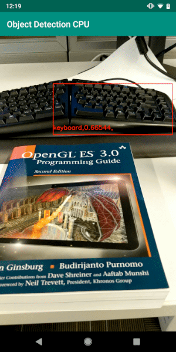
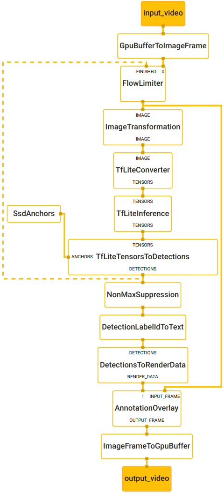

# Object Detection (CPU)

This doc focuses on the
[example graph](https://github.com/google/mediapipe/tree/master/mediapipe/graphs/object_detection/object_detection_mobile_cpu.pbtxt)
that performs object detection with TensorFlow Lite on CPU.

This is very similar to the
[Object Detection on GPU on Android](object_detection_android_gpu.md) example
except that at the beginning and the end of the graph it performs GPU-to-CPU and
CPU-to-GPU image transfer respectively. As a result, the rest of graph, which
shares the same configuration as the
[GPU graph](images/mobile/object_detection_mobile_gpu.png), runs entirely on
CPU.



## Android

[Source](https://github.com/google/mediapipe/tree/master/mediapipe/examples/android/src/java/com/google/mediapipe/apps/objectdetectioncpu)

To build and install the app:

```bash
bazel build -c opt --config=android_arm64 mediapipe/examples/android/src/java/com/google/mediapipe/apps/objectdetectioncpu
adb install bazel-bin/mediapipe/examples/android/src/java/com/google/mediapipe/apps/objectdetectioncpu/objectdetectioncpu.apk
```

## iOS

[Source](https://github.com/google/mediapipe/tree/master/mediapipe/examples/ios/handdetectiongpu).

See the general [instructions](./mediapipe_ios_setup.md) for building iOS
examples and generating an Xcode project. This will be the ObjectDetectionCpuApp
target.

To build on the command line:

```bash
bazel build -c opt --config=ios_arm64 mediapipe/examples/ios/objectdetectioncpu:ObjectDetectionCpuApp
```

## Graph



To visualize the graph as shown above, copy the text specification of the graph
below and paste it into [MediaPipe Visualizer](https://viz.mediapipe.dev/).

[Source pbtxt file](https://github.com/google/mediapipe/tree/master/mediapipe/graphs/object_detection/object_detection_mobile_cpu.pbtxt)

```bash
# MediaPipe graph that performs object detection with TensorFlow Lite on CPU.
# Used in the examples in
# mediapipie/examples/android/src/java/com/mediapipe/apps/objectdetectioncpu and
# mediapipie/examples/ios/objectdetectioncpu.

# Images on GPU coming into and out of the graph.
input_stream: "input_video"
output_stream: "output_video"

# Transfers the input image from GPU to CPU memory for the purpose of
# demonstrating a CPU-based pipeline. Note that the input image on GPU has the
# origin defined at the bottom-left corner (OpenGL convention). As a result,
# the transferred image on CPU also shares the same representation.
node: {
  calculator: "GpuBufferToImageFrameCalculator"
  input_stream: "input_video"
  output_stream: "input_video_cpu"
}

# Throttles the images flowing downstream for flow control. It passes through
# the very first incoming image unaltered, and waits for
# TfLiteTensorsToDetectionsCalculator downstream in the graph to finish
# generating the corresponding detections before it passes through another
# image. All images that come in while waiting are dropped, limiting the number
# of in-flight images between this calculator and
# TfLiteTensorsToDetectionsCalculator to 1. This prevents the nodes in between
# from queuing up incoming images and data excessively, which leads to increased
# latency and memory usage, unwanted in real-time mobile applications. It also
# eliminates unnecessarily computation, e.g., a transformed image produced by
# ImageTransformationCalculator may get dropped downstream if the subsequent
# TfLiteConverterCalculator or TfLiteInferenceCalculator is still busy
# processing previous inputs.
node {
  calculator: "FlowLimiterCalculator"
  input_stream: "input_video_cpu"
  input_stream: "FINISHED:detections"
  input_stream_info: {
    tag_index: "FINISHED"
    back_edge: true
  }
  output_stream: "throttled_input_video_cpu"
}

# Transforms the input image on CPU to a 320x320 image. To scale the image, by
# default it uses the STRETCH scale mode that maps the entire input image to the
# entire transformed image. As a result, image aspect ratio may be changed and
# objects in the image may be deformed (stretched or squeezed), but the object
# detection model used in this graph is agnostic to that deformation.
node: {
  calculator: "ImageTransformationCalculator"
  input_stream: "IMAGE:throttled_input_video_cpu"
  output_stream: "IMAGE:transformed_input_video_cpu"
  node_options: {
    [type.googleapis.com/mediapipe.ImageTransformationCalculatorOptions] {
      output_width: 320
      output_height: 320
    }
  }
}

# Converts the transformed input image on CPU into an image tensor stored as a
# TfLiteTensor.
node {
  calculator: "TfLiteConverterCalculator"
  input_stream: "IMAGE:transformed_input_video_cpu"
  output_stream: "TENSORS:image_tensor"
}

# Runs a TensorFlow Lite model on CPU that takes an image tensor and outputs a
# vector of tensors representing, for instance, detection boxes/keypoints and
# scores.
node {
  calculator: "TfLiteInferenceCalculator"
  input_stream: "TENSORS:image_tensor"
  output_stream: "TENSORS:detection_tensors"
  node_options: {
    [type.googleapis.com/mediapipe.TfLiteInferenceCalculatorOptions] {
      model_path: "ssdlite_object_detection.tflite"
    }
  }
}

# Generates a single side packet containing a vector of SSD anchors based on
# the specification in the options.
node {
  calculator: "SsdAnchorsCalculator"
  output_side_packet: "anchors"
  node_options: {
    [type.googleapis.com/mediapipe.SsdAnchorsCalculatorOptions] {
      num_layers: 6
      min_scale: 0.2
      max_scale: 0.95
      input_size_height: 320
      input_size_width: 320
      anchor_offset_x: 0.5
      anchor_offset_y: 0.5
      strides: 16
      strides: 32
      strides: 64
      strides: 128
      strides: 256
      strides: 512
      aspect_ratios: 1.0
      aspect_ratios: 2.0
      aspect_ratios: 0.5
      aspect_ratios: 3.0
      aspect_ratios: 0.3333
      reduce_boxes_in_lowest_layer: true
    }
  }
}

# Decodes the detection tensors generated by the TensorFlow Lite model, based on
# the SSD anchors and the specification in the options, into a vector of
# detections. Each detection describes a detected object.
node {
  calculator: "TfLiteTensorsToDetectionsCalculator"
  input_stream: "TENSORS:detection_tensors"
  input_side_packet: "ANCHORS:anchors"
  output_stream: "DETECTIONS:detections"
  node_options: {
    [type.googleapis.com/mediapipe.TfLiteTensorsToDetectionsCalculatorOptions] {
      num_classes: 91
      num_boxes: 2034
      num_coords: 4
      ignore_classes: 0
      sigmoid_score: true
      apply_exponential_on_box_size: true
      x_scale: 10.0
      y_scale: 10.0
      h_scale: 5.0
      w_scale: 5.0
      min_score_thresh: 0.6
    }
  }
}

# Performs non-max suppression to remove excessive detections.
node {
  calculator: "NonMaxSuppressionCalculator"
  input_stream: "detections"
  output_stream: "filtered_detections"
  node_options: {
    [type.googleapis.com/mediapipe.NonMaxSuppressionCalculatorOptions] {
      min_suppression_threshold: 0.4
      max_num_detections: 3
      overlap_type: INTERSECTION_OVER_UNION
      return_empty_detections: true
    }
  }
}

# Maps detection label IDs to the corresponding label text. The label map is
# provided in the label_map_path option.
node {
  calculator: "DetectionLabelIdToTextCalculator"
  input_stream: "filtered_detections"
  output_stream: "output_detections"
  node_options: {
    [type.googleapis.com/mediapipe.DetectionLabelIdToTextCalculatorOptions] {
      label_map_path: "ssdlite_object_detection_labelmap.txt"
    }
  }
}

# Converts the detections to drawing primitives for annotation overlay.
node {
  calculator: "DetectionsToRenderDataCalculator"
  input_stream: "DETECTIONS:output_detections"
  output_stream: "RENDER_DATA:render_data"
  node_options: {
    [type.googleapis.com/mediapipe.DetectionsToRenderDataCalculatorOptions] {
      thickness: 4.0
      color { r: 255 g: 0 b: 0 }
    }
  }
}

# Draws annotations and overlays them on top of the input images.
node {
  calculator: "AnnotationOverlayCalculator"
  input_stream: "INPUT_FRAME:throttled_input_video_cpu"
  input_stream: "render_data"
  output_stream: "OUTPUT_FRAME:output_video_cpu"
}

# Transfers the annotated image from CPU back to GPU memory, to be sent out of
# the graph.
node: {
  calculator: "ImageFrameToGpuBufferCalculator"
  input_stream: "output_video_cpu"
  output_stream: "output_video"
}
```
